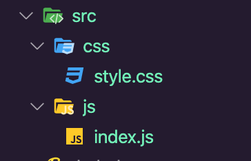

# WebPack4

Este es un pequeño manual de como crear desde 0 el proyecto, aun que se puede usar el package.json que esta en este repositorio.

## Iniciamos el proyecto con:

`npm init`

Ingresamos toda la información que nos pide.

## Instalamos Webpack

Agregamos la dependencia de webpack y para instalar esta dependencia usamos

`sudo npm install --save-dev webpack``

Esto intalara webpack en el proyecto y en el archivo json veremos lo siguiente:

```json
{
  "name": "app",
  "version": "1.0.0",
  "description": "Aprendiendo webpack",
  "main": "index.js",
  "scripts": {
    "test": "echo \"Error: no test specified\" && exit 1"
  },
  "author": "Luis Eduardo Alcantara Olvera",
  "license": "ISC",
  "devDependencies": {
    "webpack": "^4.43.0"
  }
}
```
## Instalamos el CLI de webpack

En la terminal solo ingresamos:

`sudo npm install --save-dev webpack-cli`

El archivo queda así:

```json
{
  "name": "app",
  "version": "1.0.0",
  "description": "Aprendiendo webpack",
  "main": "index.js",
  "scripts": {
    "test": "echo \"Error: no test specified\" && exit 1"
  },
  "author": "Luis Eduardo Alcantara Olvera",
  "license": "ISC",
  "devDependencies": {
    "webpack": "^4.43.0",
    "webpack-cli": "^3.3.11"
  }
}
```

## Creamos el primer bundle webpack.config.js

### Creamos un index.html

El index html para la prueba debe tener el siguiente contenido:

```html
<!DOCTYPE html>
<html lang="en">
<head>
    <meta charset="UTF-8">
    <meta name="viewport" content="width=device-width, initial-scale=1.0">
    <title>Document</title>
</head>
<body>
    <script src="dist/bundle.js"></script>
</body>
</html>
```

### Creamos un index.js

En raiz del proyecto creamos un archivo llamado **src** y dentro de el creamos un **index.js** con el siguiente contenido:

```js
const carrito = ['producto', 'producto 2', 'produco 3'];
console.log('carrito');
```

### Creamos el webpack.config.js

```js
//importamos path de node
const path = require('path'); 
module.exports = {
    // especificamos la entrada tambien se puede usar:
    // ['./src/index.js', './src/index2.js']
    entry: './src/index.js',
    output: {
        filename: 'bundle.js',
        path:path.join(__dirname, '/dist')
    }
}
```
### Creamos el script para ejecutar webpack

En el archivo **package.json** agregamos un script:

```json
{
  "name": "app",
  "version": "1.0.0",
  "description": "Aprendiendo webpack",
  "main": "index.js",
  "scripts": {
    "build": "webpack --mode development"
  },
  "author": "Luis Eduardo Alcantara Olvera",
  "license": "ISC",
  "devDependencies": {
    "webpack": "^4.43.0",
    "webpack-cli": "^3.3.11"
  }
}
```

Ahora solo tenemos que ejecutar en terminal:

`npm run build`

Esto nos genera un archivo dist/bundle.js


## Transpilar el código con Babel

Instalamos lo requerido para trabajar con babel

`npm install --save-dev @babel/cli @babel/core @babel/preset-env @babel/register babel-loader`


## Importar CSS

Instalamos las  siguientes dependencias:

`sudo npm install --save-dev style-loader css-loader`

Las carpetas deben quedar de la siguiente forma: 

<p align="center"></p>

Editamos el archivo **index.js**:

```js
// Importamos css
import '../css/style.css';

class Cliente {
    constructor(nombre){
        this.nombre = nombre;
    }
}
const cliente = new Cliente('Luis');
console.log(cliente);
```

Editamos el archivo **style.css**:

```css
body{
    background: red;
}
```

Editamos el webpack.config.js agregando soporte a css:

```js
const path = require('path'); //importamos path de node

module.exports = {
    // especificamos la entrada tambien se puede usar:
    // ['./src/index.js', './src/index2.js']
    entry: './src/js/index.js',
    output: {
        filename: 'bundle.js',
        path:path.join(__dirname, '/dist')
    },
    module: {
        rules: [
            {
                test: /\.js$/, 
                exclude: /node_modules/,
                use:{
                    loader: 'babel-loader'
                }

            },
            { 
                // agregamos soporte a css
                test: /\.css$/,
                use:[
                    { loader: 'style-loader' },
                    { loader: 'css-loader' }
                ]
            }
        ]
    }
}
```

Ahora al ejecutar `npm run watch` se puede ver el cambio en css